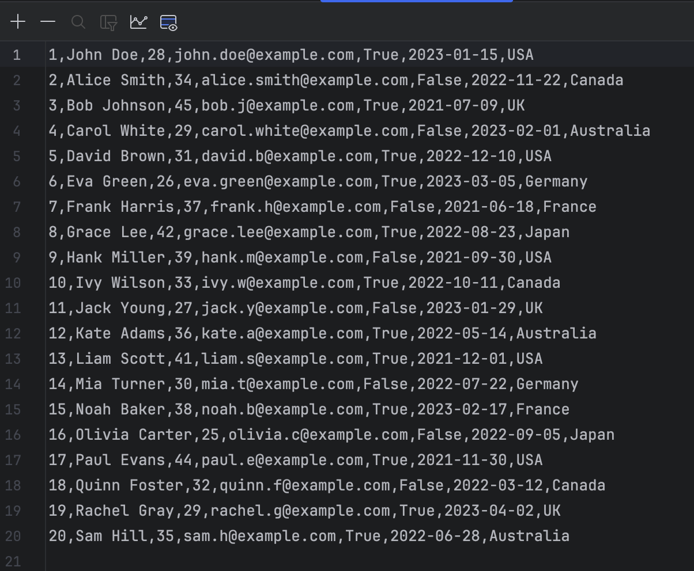
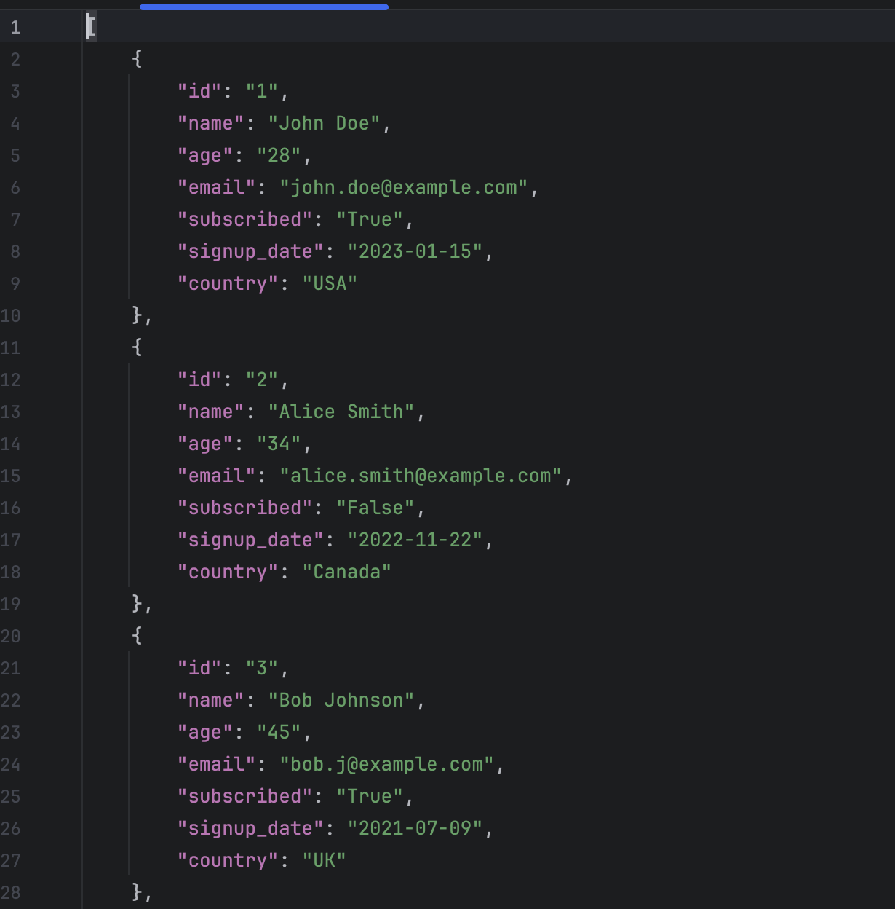

# Python CSV ↔ JSON Converter CLI

A Python CLI tool to convert data between CSV and JSON using core libraries. 

## Table of Contents
- [Project Overview](#project-overview)
- [Python Libraries](#python-libraries)
- [Setup and Installation](#setup-and-installation)
- [Usage](#usage)

## Project Overview
This project demonstrates how core python libraries such as **sys**, **csv** and **json** can be used to easily convert files between CSV and JSON formats. It also provides practical examples of how unit tests can be written using the Pytest library to validate application logic.

Python’s core libraries can handle simple data transformation tasks, providing a foundation for more advanced ETL workflows.

## Technology Stack
- **Python 3.12** - the **sys** library allows for the use of command line arguments when running the script and the **csv** and **json** libraries facilitate the file conversion logic.
- **Pytest** - provides a framework to develop and run unit tests on the application logic.


## Setup and Installation
1. Clone the repo:
```
git clone https://github.com/data-with-chris/python-csv-json-converter.git
cd python-csv-json-converter
```
2. Create and activate a virtual environment
```
python -m venv venv
source venv/bin/activate   # macOS/Linux
venv\Scripts\activate      # Windows
```
3. Install dependencies
```
pip install -r requirements.txt
```
## Usage
Run tests
```
pytest
```
Run the program
```
python main.py <filename> <output format>
```
A sample .csv file has been included, running:
```
python main.py sample_data.csv json
```
will convert the file to JSON format, and output the converted file to the same directory.

### Example

#### sample_data.csv


#### converted to JSON



